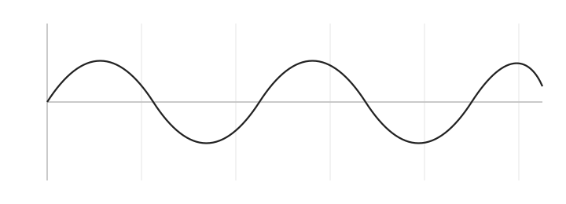

This is a production-quality **static** technical blog system: Markdown-first, LaTeX-like typography, right-side TOC, dark mode, reading progress, anchors with copy-to-clipboard, footnotes, KaTeX math, tables, and syntax highlighting.

## Inline math

Inline math uses `$...$`: Euler’s identity $e^{i\pi}+1=0$.

## Block math

Block math uses `$$...$$`:

$$\int_{-\infty}^{\infty} e^{-x^2}\,dx = \sqrt{\pi}$$

## A figure (academic style)



_Figure 1: Inline SVG via data URI (no extra files needed)._

## Tables

| Feature | Supported |
|---|---:|
| Right-side TOC | Yes |
| Dark mode | Yes |
| Footnotes | Yes |
| KaTeX | Yes |

## Nesting demo

### Level 3 (subheading)

#### Level 4 (sub-subheading)

##### Level 5

###### Level 6

This section exists to demonstrate nested headings in the TOC.

## Collapsible sections

::: details Click to expand a technical aside

This is a collapsible section written in Markdown — no HTML required.

- It supports **lists**
- And math: $e^{i\pi}+1=0$

:::

## Code blocks (with copy button)

```js
function hello(name) {
  return `Hello, ${name}`;
}

console.log(hello("world"));
```

## Footnotes

Here is a sentence with a footnote.[^1]

[^1]: This footnote is rendered by the markdown-it-footnote plugin.
